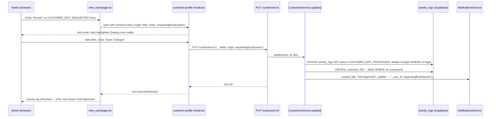

# Design Document — review-edit-request

## Overview

This feature adds an **Admin Review flow** on top of the existing `CUSTOMER_EDIT_REQUESTED` workflow. When an employee submits an edit request, a `CUSTOMER_EDIT_REQUESTED` row is written to `activity_logs`. Admins can now act on that entry directly from the customer activity log: a "Review" button opens the customer profile modal in edit mode with the requested field highlighted and the employee's notes surfaced in a floating callout. When the admin saves, the **original log row is updated in-place** (action → `CUSTOMER_EDIT_PROCESSED`, details merged with outcome data) instead of inserting a new row. The employee receives a targeted notification with the field label and old → new value.

The change is intentionally minimal: no new tables, no new endpoints, no new services. It extends three existing files on the frontend and two on the backend.

---

## Architecture



### Key Design Decisions

- **In-place log update vs. new row**: The original `CUSTOMER_EDIT_REQUESTED` row is mutated to `CUSTOMER_EDIT_PROCESSED`. This keeps the activity log clean — one entry per request, not two. The `details` JSON is merged (original fields preserved, outcome fields added) so the full audit trail is in one place.
- **logId as a DTO field, not a URL param**: The `logId` travels in the request body alongside the customer fields. This avoids a new endpoint and keeps the controller unchanged.
- **Silent fallback on log update failure**: If the `activity_logs` row is missing or already processed, the service falls back to inserting a new `CUSTOMER_EDIT_PROCESSED` row. The customer update itself never fails due to a log issue.
- **reviewContext as a prop, not a URL param**: The modal receives context via React props from the page. This avoids polluting the URL and keeps the modal reusable.

---

## Components and Interfaces

### Frontend

#### `view_user/page.tsx` — changes

**1. Review button on `CUSTOMER_EDIT_REQUESTED` feed items**

A new state variable holds the active review context:

```ts
const [reviewContext, setReviewContext] = useState<{
  logId: string;
  field: string | null;
  notes: string;
  requestingEmployeeId?: string;
} | null>(null);
```

Inside the feed rendering loop, when `item.kind === "edit_request"` and the user role is `admin` or `super_admin`, a "Review" pill button is rendered alongside the existing entry content. Clicking it sets `reviewContext` from the log entry and opens the modal:

```ts
function handleReview(log: BackendActivityLog) {
  const d = log.details as Record<string, unknown>;
  setReviewContext({
    logId: log.id,
    field: typeof d.field === "string" && d.field ? d.field : null,
    notes: typeof d.notes === "string" ? d.notes : "",
    requestingEmployeeId: log.userId ?? undefined,
  });
  setIsViewOpen(true);
}
```

The button is only rendered when:
- `item.kind === "edit_request"` (action is `CUSTOMER_EDIT_REQUESTED`)
- `user?.role === "admin" || user?.role === "super_admin"`

**2. "Edit Approved" rendering for `CUSTOMER_EDIT_PROCESSED` entries**

When `log.action === "CUSTOMER_EDIT_PROCESSED"` and `details` contains `reviewedField`, the feed item is rendered with:
- Green check icon (`bg-emerald-100 text-emerald-700`)
- Title: "Edit Approved"
- Subtitle: `<adminName>` and human-readable field label
- Value line: `<oldValue> → <newValue>` (omitted when both are empty/null)

This rendering is identical for all roles (admin, employee, super_admin) — no role gate on the display.

**3. Modal invocation with reviewContext**

The `ViewCustomerModal` is opened with the new `reviewContext` prop when set:

```tsx
<ViewCustomerModal
  customer={customer}
  onClose={() => { setIsViewOpen(false); setReviewContext(null); }}
  userRole={user?.role}
  initialAction={...}
  onCustomerRefresh={() => setRefreshToken((v) => v + 1)}
  requestingEmployeeId={reviewContext?.requestingEmployeeId ?? requestingEmployeeId}
  reviewContext={reviewContext ?? undefined}
/>
```

---

#### `customer-profile-modal.tsx` — changes

**New prop**

```ts
interface ViewCustomerModalProps {
  // ...existing props...
  reviewContext?: {
    logId: string;
    field: string | null;
    notes: string;
    requestingEmployeeId?: string;
  };
}
```

**Auto-enter edit mode**

When `reviewContext` is present, the modal enters edit mode immediately (same mechanism as `initialAction === "edit"`):

```ts
useEffect(() => {
  if (reviewContext) {
    setIsEditing(true);
    appliedInitialAction.current = true;
  }
}, [reviewContext]);
```

**Field highlight**

`EditableField` receives an optional `highlighted` boolean prop. When `true`, the input gets an additional ring class:

```ts
// ring class added to input when highlighted:
"ring-2 ring-amber-400 border-amber-400"
```

The highlighted field is determined by `reviewContext.field` matching the field key (e.g., `"contact_number"`).

**Floating note callout**

When `reviewContext?.notes` is non-empty, a callout box is rendered above or near the highlighted field:

```tsx
{reviewContext?.notes && (
  <div className="rounded-2xl border border-amber-200 bg-amber-50 px-4 py-3 flex items-start gap-2">
    <svg ...pencil icon... className="text-amber-600 mt-0.5 flex-shrink-0" />
    <div>
      <p className="text-[10px] font-black uppercase tracking-[0.2em] text-amber-700">Employee Note</p>
      <p className="mt-1 text-sm text-amber-900">{reviewContext.notes}</p>
    </div>
  </div>
)}
```

**logId in save payload**

```ts
await updateCustomer(customer.id, {
  ...fields,
  ...(requestingEmployeeId ? { requestingEmployeeId } : {}),
  ...(reviewContext?.logId ? { logId: reviewContext.logId } : {}),
});
```

---

### Backend

#### `update-customer.dto.ts` — changes

```ts
@IsOptional()
@IsString()
logId?: string;
```

#### `customers.service.ts` — `update()` changes

The `update()` method gains a log-update branch. After the customer row is updated and `changedFields` is computed:

```ts
const { requestingEmployeeId, logId, ...supabasePayload } = updateDto;
```

**Log update logic (pseudocode)**:

```
if logId is provided:
  fetch activity_logs row WHERE id = logId
  if row exists AND row.action === 'CUSTOMER_EDIT_REQUESTED':
    merge details:
      originalDetails = row.details (parsed)
      reviewedField = first key in changedFields (or null)
      oldValue = changedFields[reviewedField]?.from
      newValue = changedFields[reviewedField]?.to
      mergedDetails = {
        ...originalDetails,
        processedAt: new Date().toISOString(),
        adminName: user.fullName ?? user.email,
        adminId: user.id,
        reviewedField,
        oldValue,
        newValue,
      }
    UPDATE activity_logs SET action='CUSTOMER_EDIT_PROCESSED', details=mergedDetails WHERE id=logId
  else:
    log warning, fall back to INSERT new CUSTOMER_EDIT_PROCESSED row
else:
  INSERT new CUSTOMER_EDIT_PROCESSED row (existing behavior)
```

**Notification subtitle** (when `logId` is present and `requestingEmployeeId` is present):

```ts
const fieldLabelMap: Record<string, string> = {
  full_name: "Full Name",
  contact_number: "Contact Number",
  address: "Address",
  email: "Email Address",
  barangay: "Barangay",
  city: "City",
  region: "Region",
  id_presented: "ID Presented",
};

const fieldLabel = reviewedField ? (fieldLabelMap[reviewedField] ?? reviewedField) : "profile";
const subtitle = oldValue && newValue
  ? `${actorLabel} updated ${fieldLabel}: ${oldValue} → ${newValue}`
  : `${actorLabel} updated ${fieldLabel}`;
```

---

## Data Models

### `activity_logs` row — `CUSTOMER_EDIT_REQUESTED` (before review)

```json
{
  "id": "<uuid>",
  "action": "CUSTOMER_EDIT_REQUESTED",
  "user_id": "<employee-uuid>",
  "branch_id": "<branch-uuid>",
  "details": {
    "customerId": "<customer-uuid>",
    "customerName": "Juan Dela Cruz",
    "notes": "Please update contact number to 09321...",
    "field": "contact_number",
    "mode": "specific",
    "branchName": "Taguig Branch",
    "actorLabel": "Maria Santos (Employee)"
  }
}
```

### `activity_logs` row — after in-place update to `CUSTOMER_EDIT_PROCESSED`

```json
{
  "id": "<same-uuid>",
  "action": "CUSTOMER_EDIT_PROCESSED",
  "user_id": "<employee-uuid>",
  "branch_id": "<branch-uuid>",
  "details": {
    "customerId": "<customer-uuid>",
    "customerName": "Juan Dela Cruz",
    "notes": "Please update contact number to 09321...",
    "field": "contact_number",
    "mode": "specific",
    "branchName": "Taguig Branch",
    "actorLabel": "Maria Santos (Employee)",
    "processedAt": "2025-01-15T10:30:00.000Z",
    "adminName": "Jeremiah Cruz",
    "adminId": "<admin-uuid>",
    "reviewedField": "contact_number",
    "oldValue": "09123456789",
    "newValue": "09321654987"
  }
}
```

### `UpdateCustomerDto` — extended

```ts
{
  full_name?: string;
  address?: string;
  barangay?: string;
  city?: string;
  region?: string;
  contact_number?: string;
  email?: string;
  id_presented?: string;
  requestingEmployeeId?: string;  // existing
  logId?: string;                 // NEW
}
```

### `ReviewContext` (frontend type)

```ts
type ReviewContext = {
  logId: string;
  field: string | null;
  notes: string;
  requestingEmployeeId?: string;
};
```

### Field label map (shared between frontend and backend)

```ts
const FIELD_LABEL_MAP: Record<string, string> = {
  full_name: "Full Name",
  contact_number: "Contact Number",
  address: "Address",
  email: "Email Address",
  barangay: "Barangay",
  city: "City",
  region: "Region",
  id_presented: "ID Presented",
};
```

---

## Correctness Properties

*A property is a characteristic or behavior that should hold true across all valid executions of a system — essentially, a formal statement about what the system should do. Properties serve as the bridge between human-readable specifications and machine-verifiable correctness guarantees.*

### Property 1: Review button visibility is role- and action-gated

*For any* list of activity log entries and any user role, a "Review" button should appear on an entry if and only if the entry's action is `CUSTOMER_EDIT_REQUESTED` AND the user's role is `admin` or `super_admin`.

**Validates: Requirements 1.1, 1.2, 1.4**

---

### Property 2: Field highlight matches reviewContext.field

*For any* field key present in the known field set (`full_name`, `contact_number`, `address`, `email`, `barangay`, `city`, `region`), rendering the Customer_Profile_Modal with a `reviewContext` containing that field key should apply the highlight class to exactly that input and no other. When `reviewContext.field` is null, no input should have the highlight class.

**Validates: Requirements 2.2, 2.3**

---

### Property 3: Save payload includes logId and requestingEmployeeId from reviewContext

*For any* `reviewContext` with a non-null `logId` and any `requestingEmployeeId`, the `updateCustomer` call triggered by saving the modal should include both `logId` and `requestingEmployeeId` in the payload with their exact values from the context.

**Validates: Requirements 2.5, 4.2, 4.3, 9.5**

---

### Property 4: Floating note renders iff notes is non-empty

*For any* `reviewContext`, the Floating_Note element should be present in the rendered modal output if and only if `reviewContext.notes` is a non-empty string. When `reviewContext` is absent or `notes` is empty/whitespace, no Floating_Note should be rendered.

**Validates: Requirements 3.1, 3.2, 3.4, 3.5**

---

### Property 5: Log update in-place when logId is valid

*For any* valid `logId` that corresponds to an existing `CUSTOMER_EDIT_REQUESTED` row, calling `CustomersService.update()` with that `logId` should result in an UPDATE (not INSERT) on `activity_logs` for that row, with `action` set to `CUSTOMER_EDIT_PROCESSED` and the `details` JSON containing all original fields plus `processedAt`, `adminName`, `adminId`, `reviewedField`, `oldValue`, and `newValue`.

**Validates: Requirements 5.1, 5.2, 5.3, 10.2, 10.3**

---

### Property 6: Details merge preserves all original fields

*For any* original `CUSTOMER_EDIT_REQUESTED` details object (with arbitrary keys and values), the merged `CUSTOMER_EDIT_PROCESSED` details should be a superset — every key from the original should be present with its original value, and the new outcome keys should be added without overwriting originals (except `action` which is updated at the row level).

**Validates: Requirements 5.3**

---

### Property 7: Fallback to insert when logId is absent or row not found

*For any* call to `CustomersService.update()` where `logId` is absent, or where the `activity_logs` row with that `logId` does not exist or has an unexpected action, the service should fall back to inserting a new `CUSTOMER_EDIT_PROCESSED` row and should still return a success response (the customer update should not fail).

**Validates: Requirements 5.4, 5.5, 10.4**

---

### Property 8: "Edit Approved" rendering is role-invariant

*For any* `CUSTOMER_EDIT_PROCESSED` activity log entry whose `details` contains `reviewedField`, `oldValue`, and `newValue`, the rendered feed item should be identical for `admin`, `employee`, and `super_admin` roles — containing a green check icon, the title "Edit Approved", `adminName`, the human-readable field label, and the `<oldValue> → <newValue>` string (omitted when both are null/empty).

**Validates: Requirements 6.1, 6.2, 6.3, 6.4, 6.5, 7.1, 7.2**

---

### Property 9: Employee notification subtitle format

*For any* combination of `adminName`, `fieldLabel`, `oldValue`, and `newValue`, the notification subtitle produced by `CustomersService.update()` during the Review flow should equal `"<adminName> (Admin) updated <fieldLabel>: <oldValue> → <newValue>"` when both values are non-empty, and `"<adminName> (Admin) updated <fieldLabel>"` when values are absent.

**Validates: Requirements 8.1, 8.2, 8.3**

---

### Property 10: Notification failure does not fail the update

*For any* scenario where `NotificationsService.create()` throws an error, `CustomersService.update()` should still return `{ message: "Customer updated successfully" }` without propagating the error.

**Validates: Requirements 8.5**

---

## Error Handling

| Scenario | Behavior |
|---|---|
| `logId` provided but row not found | Silent warning log, fall back to INSERT new `CUSTOMER_EDIT_PROCESSED` row |
| `logId` provided but row has unexpected action | Silent warning log, fall back to INSERT |
| `activity_logs` UPDATE fails (DB error) | Silent error log, fall back to INSERT; customer update proceeds |
| `NotificationsService.create()` throws | Caught silently; customer update proceeds |
| `reviewContext.field` not in known field map | No highlight applied; modal opens in edit mode without highlight |
| `reviewContext.notes` is empty string | No Floating_Note rendered |
| Admin saves with no changes (not dirty) | Save button not shown (existing `isDirty` guard); no API call |

---

## Testing Strategy

### Unit Tests (example-based)

- `customer-profile-modal`: clicking "Review" opens modal in edit mode with correct props
- `customer-profile-modal`: save payload includes `logId` and `requestingEmployeeId` when reviewContext is set
- `customer-profile-modal`: save payload does NOT include `logId` when reviewContext is absent
- `view_user/page`: Review button appears for admin on `CUSTOMER_EDIT_REQUESTED` entries
- `view_user/page`: Review button does NOT appear for employee role
- `view_user/page`: `CUSTOMER_EDIT_PROCESSED` entry renders "Edit Approved" title and green check
- `CustomersService.update()`: calls Supabase UPDATE on `activity_logs` when `logId` is provided
- `CustomersService.update()`: calls Supabase INSERT on `activity_logs` when `logId` is absent
- `CustomersService.update()`: notification created with correct title/subtitle when `requestingEmployeeId` present

### Property-Based Tests

Using a property-based testing library (e.g., [fast-check](https://github.com/dubzzz/fast-check) for TypeScript):

- **Property 1** — Generate random arrays of log entries with random actions and random roles; assert Review button presence matches the predicate `action === CUSTOMER_EDIT_REQUESTED && (role === admin || role === super_admin)`.
- **Property 2** — Generate random field keys from the known set (plus null); assert highlight class appears on exactly the matching input.
- **Property 3** — Generate random `logId` strings and `requestingEmployeeId` strings; assert both appear verbatim in the `updateCustomer` call payload.
- **Property 4** — Generate random notes strings (including empty, whitespace-only, and non-empty); assert Floating_Note presence matches `notes.trim().length > 0`.
- **Property 5** — Mock Supabase; generate random `logId` UUIDs with matching `CUSTOMER_EDIT_REQUESTED` rows; assert UPDATE is called (not INSERT) with correct action and merged details.
- **Property 6** — Generate random original details objects with arbitrary keys; assert merged details is a superset of the original.
- **Property 7** — Mock Supabase to return no row for any `logId`; assert service returns success and INSERT is called.
- **Property 8** — Generate random `CUSTOMER_EDIT_PROCESSED` log entries with random `reviewedField`/`oldValue`/`newValue`; assert rendered output is identical across all three roles.
- **Property 9** — Generate random `adminName`, `fieldLabel`, `oldValue`, `newValue` strings; assert subtitle matches the expected format string.
- **Property 10** — Mock `NotificationsService.create()` to throw; assert `update()` still returns `{ message: "Customer updated successfully" }`.

Each property test should run a minimum of **100 iterations**.

Tag format for each test: `// Feature: review-edit-request, Property <N>: <property_text>`
